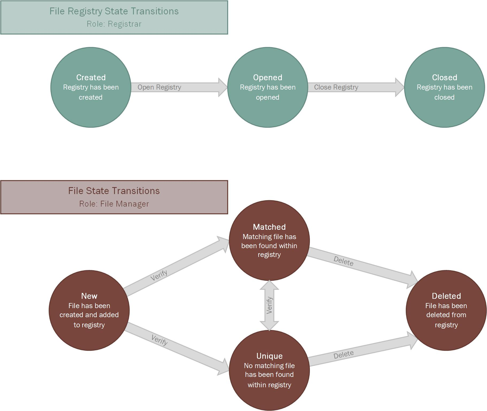

# File Registry for Azure Blockchain Workbench
Ethereum-based file registry system for use through Azure Blockchain Workbench with OneDrive integration

### Workflows
----

**File registries** : contain an array of files, each of which is compared to all others in the same registry when verified

**Files** : store data pertaining to a file that was uploaded to OneDrive

### Workflow Details
----

